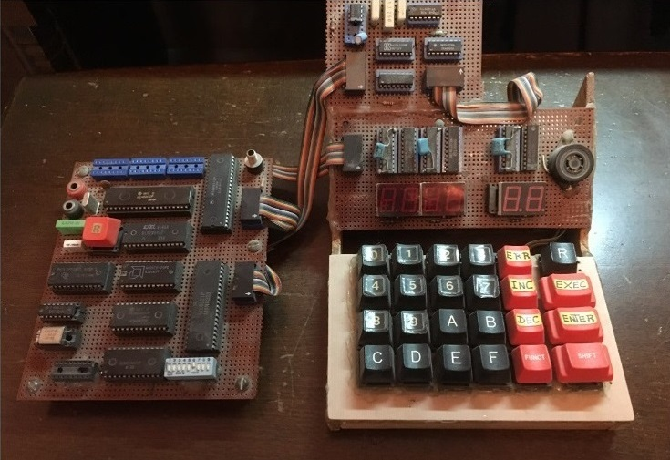
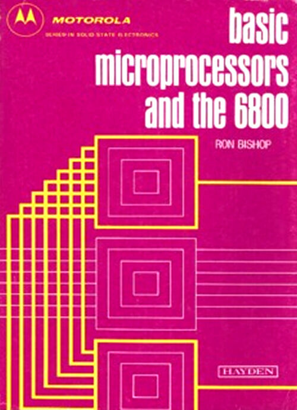

This project involves building a home computer centered on the 6802 Microprocessor. It features a hexadecimal keyboard with seven-segments displays for editing bytes in RAM. 

This project was inspired by reading Ron Bishop's book:

An EEPROM 2864 is used to store the program responsible for managing key presses and display.
This program is designed for this micro board, and the comments within the code provide details about the memory map, address mapping, and various sections of the program.

Here's a brief summary of the program structure and functionalities:

Memory Map and Addressing:

The program starts by defining the memory map, specifying the addresses for SRAM, PIA (Peripheral Interface Adapter) for 7-segment display, PIA for the keyboard, ASCIA (Asynchronous Serial Communication Interface Adapter), and EEPROM.

# PIA Configuration

Configuration of PIAs for seven-segment display and keyboard is defined with specific address assignments.
PIA configuration includes setting control registers, direction of input/output pins, and other parameters.

## Data Section

The program defines a data section with variables stored in RAM, including stack pointer, buffers for hex values and segment values of the display, and various other variables.

### Initialization and Reset Vector

The program initializes the stack pointer, configures the PIAs, and sets up interrupt vectors.
The reset vector points to the RSTVECT section.

Main Program Loop:
The main program starts with the RSTVECT section, which initializes various components and displays the version information.
The program enters a loop (NEWADD to NEXTKEY), waiting for keyboard input, processing key presses, and performing actions based on the pressed keys.

Subroutines and Functions:
The program includes various subroutines for tasks such as displaying messages, beeping, handling interrupts, and processing keyboard input.
Subroutines are used for specific tasks like displaying messages, handling keyboard input, converting hex to 7-segment display codes, and more.
Interrupt Handling:

The program has an interrupt vector (IRQVECT) that handles interrupts, specifically from the ACIA (Asynchronous Communication Interface Adapter).
The interrupt service routine (IRQACIA) processes received characters and retransmits them.

Serial Communication Initialization:
There's an ASCIAINI section that initializes the Asynchronous Serial Communication Interface Adapter (ACIA) for serial communication.

Printing and Display:
The program includes functions for sending characters (SENDCHAR), printing strings (PRINTSTR, PRNTSTR2), and displaying messages on the 7-segment display.

Hex-to-Display Code Conversion:
Hexadecimal values are converted to 7-segment display codes using lookup tables (CODTAB).
The CONVERTI subroutine performs this conversion.

EEPROM Loading:
There's a section for loading data from EEPROM (LOADCOD), but the actual implementation is not provided in the code snippet.

Delay and Beep:
There are subroutines for generating delays (DELAYA) and beeping sounds (BEEP, ALERTE).
